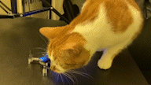
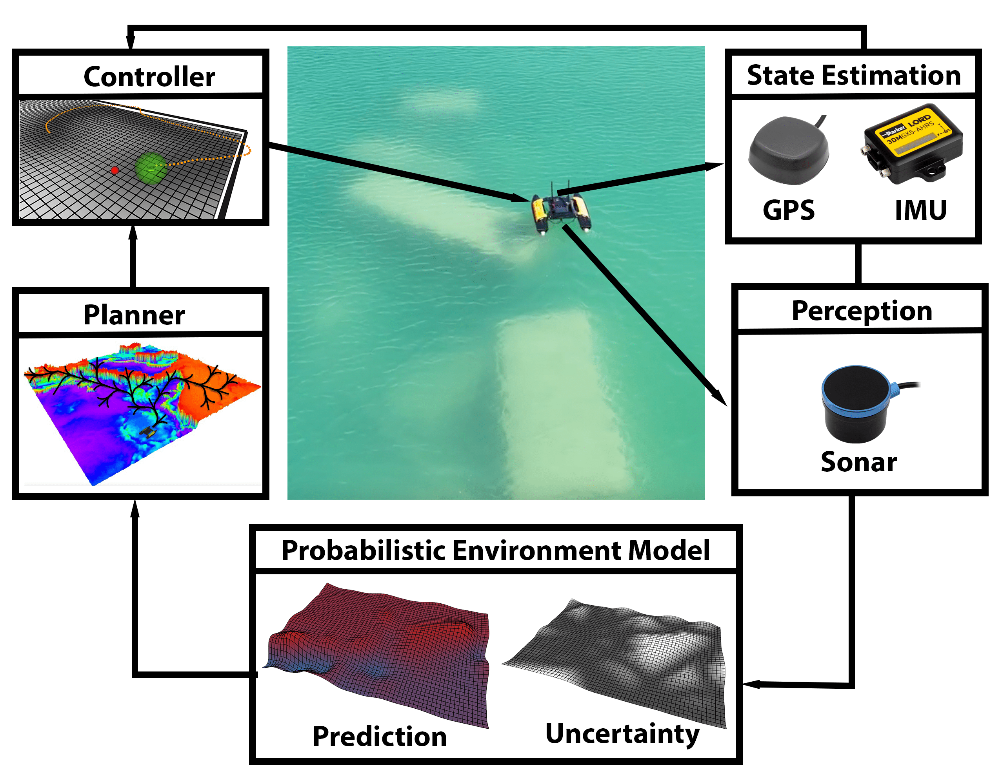

# What is this? 🧐
<center>
PyPolo is a Python library for <b>Robotic Information Gathering</b>

</center>

This is my fluffy friend -- Caramel -- learning about a drone she has never seen.
She listens attentively, touches and sniffs the drone actively, and changes her angle of view to gather more information about this unknown object.
Can robots also exhibit such *active information acquisition* behavior?

## What is Robotic Information Gathering? 🤖
Robotic Information Gathering is a research topic in Robotics that aims to answer the following question:

**How does a robot (team) collect *observations* to *efficiently* build an *accurate* model of a physical process under robot *embodiment constraints*?**

To endow robots with the ability to gather valuable information actively, we need to develop an *integrated planning and learning* system. The learning algorithm should provide the uncertainty of its prediction, and the planning algorithm should consider the uncertainty to collect informative observations or make informed decisions.
The following diagram shows the workflow of an example application: active underwater elevation mapping using an Autonomous Surface Vehicle.
Other applications include but not limited to autonomous exploration, 3D reconstruction or inspection, search and rescue, environmental modeling and monitoring, active dynamics learning, and active localization.

<center></center>

## Why would I use this library? 🤷
As we can see from the above diagram, planning relies on the learning component while learning depends on the data collected by the planner and controller.
The interdisciplinary nature of Robotic Information Gathering can make it relatively daunting for beginners to get started, compared to studying planning, learning, or control problem alone.
I hope PyPolo can lower the entry bar of this domain and help the researchers to focus on a single aspect of the problem when prototyping their algorithms. 
PyPolo has the following features.

* **Interactive Tutorials** to guide you to the world of Robotic Information Gathering.
* **Detailed Documentation & Readable Code** to help you understand the basic idea of each algorithm.
* **Minimum Dependency & Cross-Platform Support** :-) start your robotics journey without getting stuck in [Ubuntu](https://ubuntu.com/) and [Robot Operating System (ROS)](https://www.ros.org/).
* **Modular Implementation** to facilitate the development of new algorithms.
* **ROS**. PyPolo does not depend on ROS, but we provide tutorials on deploying the algorithms to simulated robots in ROS.

# Installation 📥
1. Create a virtual environment
    ```bash
    conda create -n rig python=3.8
    conda activate rig
    ```
2. Clone this repository
    ```bash
    git clone https://github.com/Weizhe-Chen/PyPolo.git
    ```
3. Install PyPolo
    ```bash
    pip install -e .
    ```

# Get Started ⭐
