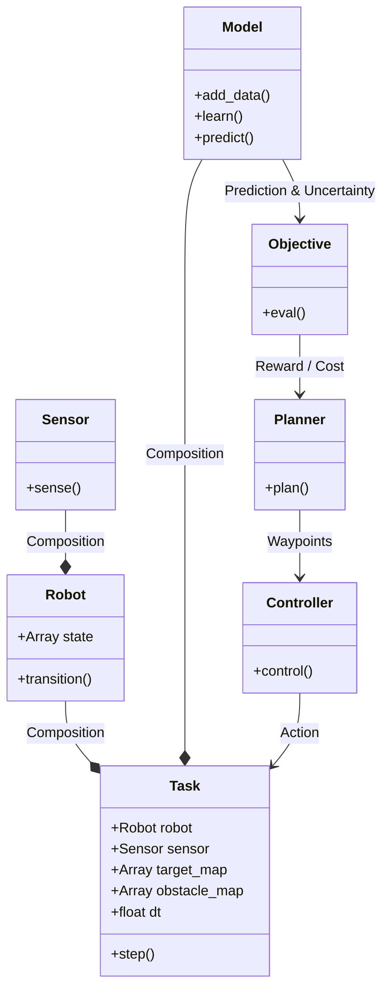

# Framework

{: style="height:100%;width:100%"}

## Class Diagram

## Models

- [x] Gaussian Process Regression (GPR)
- [ ] Occupanocy Grid Map (OGM)

## Objectives

- [x] Entropy

## Planners

- [x] Myopic Planner
- [ ] Monte Carlo Tree Search (MCTS)
- [ ] Rapidly-Exploring Random Trees (RRT)
- [ ] Bayesian Optimization (BO)
- [ ] Covariance Matrix Adaptation Evolution Strategy (CMA-ES)

## Controllers

- [ ] Proportional Derivative (PD) Controller
- [ ] Model Predictive Controller (MPC)

## Sensors

- [x] Single-Beam Ranger
- [ ] Multi-Beam Ranger

## Robots

- [ ] Omni-Directional Robot
- [x] Differential-Drive Robot
- [ ] Ackermann-Steering Robot

## Tasks

{: style="height:100%;width:100%"}

- [ ] Navigation
- [x] Active Mapping
    - [x] Environmental Mapping
    - [ ] Occupancy Mapping
- [ ] Active Localization
- [ ] Active Simultaneous Localization and Mapping (SLAM)
- [ ] Autonomous Inspection
- [ ] Search and Rescue
